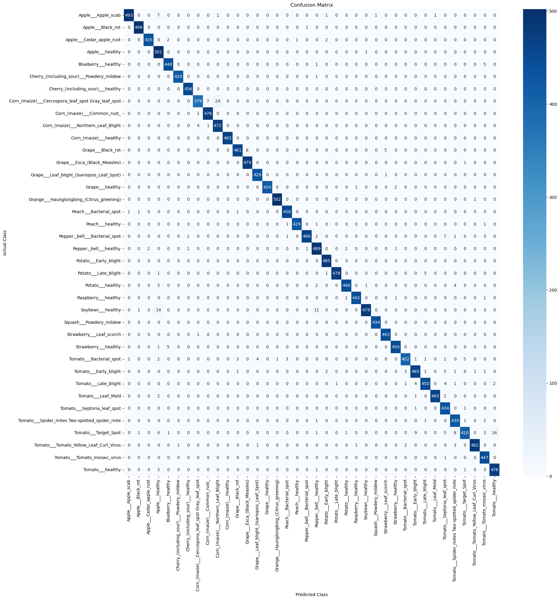

# Plant Disease Detection

---

# 🌿 Plant Disease Detection using MobileNetV2 (from Scratch)

This repository contains the code for a Deep Learning model to detect and classify 38 different plant diseases from leaf images.

The core of this project is a complete, **from-scratch implementation of the MobileNetV2 architecture** using the TensorFlow and Keras Functional API. This model was built to demonstrate a foundational understanding of modern CNN architectures and high-performance training pipelines.

---

## 🎓 Academic Project Context

This project is submitted as part of the 5th Semester B.Tech (Data Science & Artificial Intelligence) curriculum for the course **DS306: Deep Learning**.

* **Institution:** IcfaiTech, Icfai Foundation for Higher Education, Hyderabad
* **Student:** Aditya Kumar Sethia
* **Semester:** 5th Semester (3rd Year)

---

## ✨ Key Features

* **MobileNetV2 from Scratch:** The architecture is not pre-loaded from `tf.keras.applications`. It is built from the ground up, including the core **Inverted Residual Blocks** and **Linear Bottlenecks**.
* **38-Class Classification:** The model is trained to identify 38 distinct plant/disease classes.
* **High-Performance Data Pipeline:** Utilizes `tf.data` for efficient (on-the-fly) data loading, prefetching, and caching to prevent data bottlenecks.
* **GPU-Powered Augmentation:** Data augmentation (flips, rotations, zoom) is handled on the GPU as part of the model to maximize training efficiency.
* **Mixed Precision Training:** Implements `mixed_float16` to leverage the Tensor Cores on the RTX 4060, doubling training speed and reducing VRAM usage.

---

## 📊 Dataset

The model is trained on the **New Plant Diseases Dataset (Augmented)**, a public dataset from Kaggle.

* **Source:** [Kaggle Dataset Link](https://www.kaggle.com/datasets/vipoooool/new-plant-diseases-dataset)
* **Content:** 87,000+ images of plant leaves.
* **Classes:** 38
* **Resolution:** Processed at 224x224, the standard input for MobileNetV2.

---

## 🏛️ Architecture: MobileNetV2

The primary technical challenge of this project was implementing the MobileNetV2 architecture as described in the paper [MobileNetV2: Inverted Residuals and Linear Bottlenecks](https://arxiv.org/abs/1801.04381).

Our implementation correctly builds the **Inverted Residual Block**, which is characterized by:
1.  **Expansion:** A 1x1 Pointwise convolution "expands" the channel depth.
2.  **Depthwise:** A 3x3 Depthwise convolution performs lightweight spatial filtering.
3.  **Projection:** A 1x1 Pointwise convolution (the "Linear Bottleneck") "squeezes" the channels back down *without* a ReLU activation, preserving information.
4.  **Residual Connection:** A skip connection is added when the input and output dimensions match.


---

## 💻 Tech Stack & Hardware

* **Framework:** TensorFlow 2.x
* **Language:** Python 3.x
* **Key Libraries:** `tf.keras` (Functional API), `tf.data`, `numpy`, `matplotlib`
* **Training Hardware:** NVIDIA GeForce RTX 4060 (8GB Laptop GPU)

---

## 🚀 How to Run

### Clone the repository:
    
    ```bash
    git clone https://github.com/AdityaKumarSethia/PlantDiseaseDetection 
    ```

### Create a virtual environment and install dependencies:
    
    ```bash
    python -m venv venv
    source venv/bin/activate  # On Windows, use `venv\Scripts\activate`
    pip install -r requirements.txt
    ```

### 📥 Downloading the Dataset

To run this project, you need the **New Plant Diseases Dataset (Augmented)**.

1.  **Download:** Go to the Kaggle dataset page: [New Plant Diseases Dataset](https://www.kaggle.com/datasets/vipoooool/new-plant-diseases-dataset).
2.  **Extract:** Download the archive and unzip it directly into the **root folder** of this project.
3.  **Test Images:** Create a folder named `test/test/` in the root directory and place your unlabelled test images there (or use the sample images provided in the repository).

**Required Directory Structure:**

After extraction, your project folder should look exactly like this:

```text
root/
├── New Plant Diseases Dataset(Augmented)/
│   ├── train/          # Contains 38 disease subfolders
│   └── valid/          # Contains 38 disease subfolders
├── test/
│   └── test/           # Place your 33+ random test images here
├── models/
│   └── mobilenetv2_from_scratch.keras
├── notebooks/
├── main.py
└── ...

```

### ⚡ Quick Evaluation (Skip Training)
**⚠️ Important: Training this model from scratch takes approximately 8 to 12 hours on an NVIDIA RTX 4060 GPU.**

For evaluation and grading purposes, do not run the training script. Instead, use the pre-trained model and evaluation scripts provided below to verify the results instantly.

**Option 1: Run the Python Script (Recommended)**\
We have provided a standalone script that loads the saved model, predicts on the test folder, and generates a visual result grid.

Open your terminal in the project root.

Run the following command:
```bash
python test_prediction.py
```
>>Output: This will generate a file named test_results_grid.png in your folder, showing the predictions and confidence scores for your test images.

**Option 2: Interactive Notebook**\
If you want to see the confusion matrix and classification report interactively:

+ Open Jupyter Notebook:

```bash
jupyter notebook
```
1. Navigate to notebooks/ and open ModelTesting.ipynb.
2. Run all cells. This will:
3. Load the pre-trained model.
4. Calculate Accuracy (98.4%) and Loss on the validation set.
5. Display the Confusion Matrix and Classification Report.
6. Show the visual prediction grid.

---

## 📈 Results and Performance

The model was trained from scratch for **[48/100 of Epochs]** epochs. The training was completed in approximately **[8.5]** hours on the Laptop GPU RTX 4060.

The following results were achieved on the validation set:

* **Final Validation Accuracy:** **[98.4]%**
* **Final Validation Loss:** **[0.05]%**

And This are the images of my Test Output and Confusion Matrix :

1. **Confusion Matrix**


2. **Test Output**

---